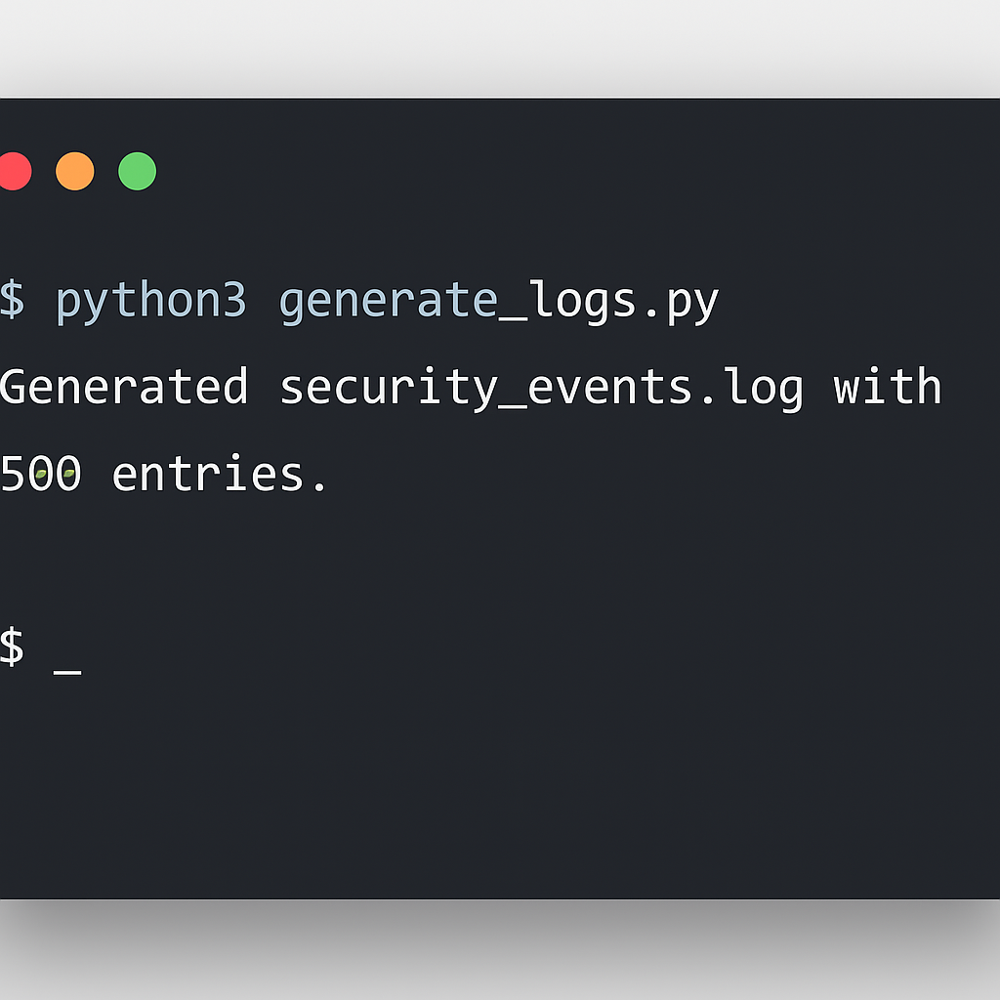
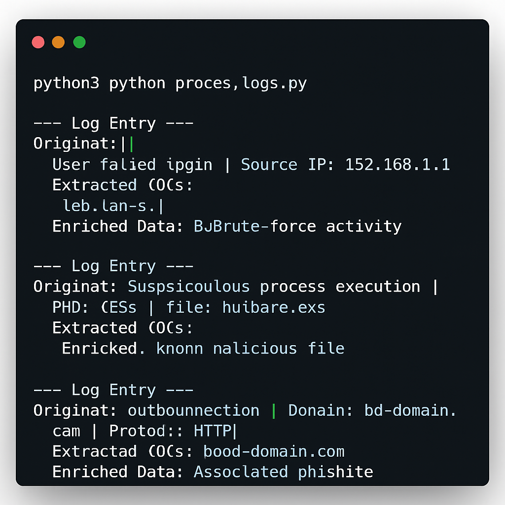

# Threat Intelligence Integration for SOC L1 Analysts

## Project Overview

This project demonstrates the practical application of cyber threat intelligence (CTI) by a Security Operations Center (SOC) L1 analyst. It focuses on enhancing alert triage, incident investigation, and proactive threat hunting within a simulated SOC environment. The project covers theoretical foundations of CTI, explores open-source threat intelligence (OSINT) tools, and provides a hands-on simulation of log generation and threat intelligence enrichment.

## Key Objectives

*   Understand the fundamentals of cyber threat intelligence (CTI) and its relevance to SOC operations.
*   Identify and utilize open-source threat intelligence (OSINT) sources and tools.
*   Develop a process for integrating threat intelligence into a simulated SIEM for alert enrichment.
*   Practice using threat intelligence to analyze alerts and prioritize incidents.
*   Demonstrate basic threat hunting techniques using threat intelligence.

## Project Structure

```
Threat-Intelligence-SOC-L1/
├── README.md
├── LICENSE
├── .gitignore
├── images/
│   ├── log_generation_output.png
│   └── log_processing_output.png
└── src/
    ├── theoretical_foundation.md
    ├── generate_logs.py
    ├── process_logs.py
    ├── security_events.log
    └── processed_security_events.json
```

## Setup and Usage

This section provides step-by-step instructions on how to set up and run the project, including visual aids to guide you through the process.

### Prerequisites

*   Python 3.x installed on your system.
*   Basic understanding of command-line interface.

### Installation

1.  **Clone the repository:**
    Open your terminal or command prompt and clone this GitHub repository to your local machine:
    ```bash
    git clone https://github.com/SiddhSamarth/Threat-Intelligence-SOC-L1.git
    ```

2.  **Navigate to the project directory:**
    Change your current directory to the newly cloned project folder:
    ```bash
    cd Threat-Intelligence-SOC-L1
    ```

### Running the Project

Follow these steps to generate simulated security logs, process them with simulated threat intelligence, and analyze the results.

#### Step 1: Generate Simulated Logs

First, we will generate a file containing simulated security events. These logs will include various Indicators of Compromise (IOCs) that we will later enrich with threat intelligence.

1.  **Navigate to the `src` directory:**
    ```bash
    cd src
    ```

2.  **Run the log generation script:**
    Execute the `generate_logs.py` script using Python. This will create a file named `security_events.log` in the `src` directory.
    ```bash
    python3 generate_logs.py
    ```

    You should see an output similar to this in your terminal, confirming the log file generation:
    
    

#### Step 2: Process Logs and Simulate Threat Intelligence Enrichment

Next, we will process the generated logs. The `process_logs.py` script will extract IOCs from `security_events.log` and simulate lookups against threat intelligence sources (like VirusTotal and AbuseIPDB) to enrich these IOCs with reputation data.

1.  **Ensure you are in the `src` directory.** If not, navigate there:
    ```bash
    cd src
    ```

2.  **Run the log processing script:**
    Execute the `process_logs.py` script. This script will output some of the processed log entries directly to your terminal and save the full enriched data to `processed_security_events.json`.
    ```bash
    python3 process_logs.py
    ```

    The terminal output will show examples of original log entries, extracted IOCs, and their simulated enrichment. This demonstrates how threat intelligence adds context to raw log data:
    
    

#### Step 3: Analyze Enriched Logs

Finally, you can examine the `processed_security_events.json` file to see the full output of the threat intelligence enrichment. This JSON file contains each original log entry, the IOCs extracted from it, and the simulated threat intelligence data for each IOC.

1.  **Open `processed_security_events.json`:**
    You can open this file using any text editor (e.g., VS Code, Notepad++, Sublime Text) or a JSON viewer. You can also use Python to parse and analyze its content programmatically for further insights.

    Example of how to view the file content from the terminal (if you have `less` installed):
    ```bash
    less processed_security_events.json
    ```
    (Press `q` to exit `less`)

This file is the core output of the project, showcasing how threat intelligence can transform raw log data into actionable insights for a SOC L1 analyst.

## Visual Aids

To help visualize the project's execution, we have included screenshots directly within the setup and usage instructions above. For a more dynamic presentation, consider creating a video demonstration.

### Video Demonstration (Suggested)

While I cannot directly generate videos, you can create a video demonstration of this project by:

1.  **Recording your screen** as you execute the `generate_logs.py` and `process_logs.py` scripts in your terminal.
2.  **Showing the contents** of `security_events.log` and `processed_security_events.json` to highlight the changes and enrichment.
3.  **Narrating** the process and explaining the significance of each step, especially how threat intelligence is applied.

This video can then be uploaded to platforms like YouTube and linked in this README for a more dynamic presentation of the project.

## Documentation

The `src/theoretical_foundation.md` file contains detailed documentation on:

*   Introduction to Cyber Threat Intelligence (CTI) and its lifecycle.
*   Different types of threat intelligence (Strategic, Operational, Tactical, Technical).
*   Common Open-Source Intelligence (OSINT) sources and tools relevant to SOC L1 analysts.
*   Concepts of threat intelligence integration, alert triage, and basic threat hunting.

## License

This project is licensed under the MIT License - see the [LICENSE](LICENSE) file for details.

## Credits

This project was developed by Siddh Samarth.

*   **GitHub Profile:** [SiddhSamarth](https://github.com/SiddhSamarth)
*   **GitHub Username:** SiddhSamarth


